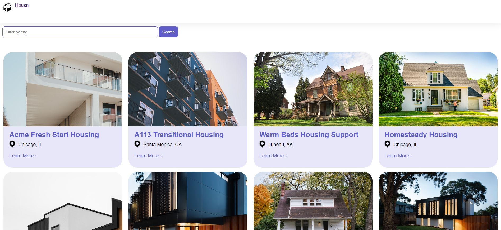
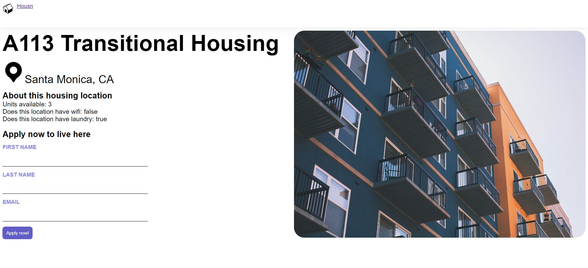

# Housn

This project was generated with [Angular CLI](https://github.com/angular/angular-cli) version 18.2.3.

## Development server

Run `ng serve` for a dev server. Navigate to `http://localhost:4200/`.

Run `json-server --watch db.json` to spin up a mock json server that serves the housing location data required by the angular app.

## Build

Run `ng build` to build the project. The build artifacts will be stored in the `dist/` directory.

## Screenshots

